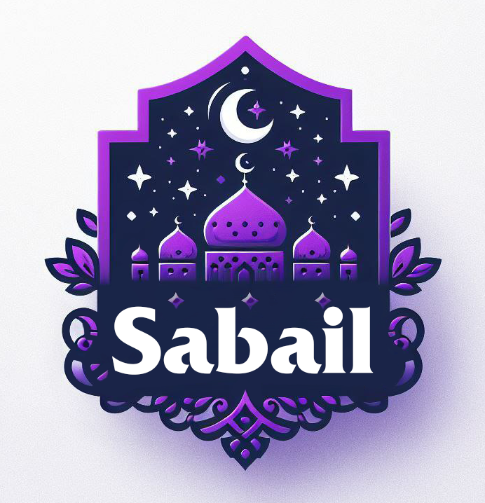

# sabail

This application provides access to various Islamic materials, including 99 Names of Allah, Hadiths, Duas, and more.

## Installation

1. Download the application from the Play Market.
2. Enjoy the functionality!

## License

This application is distributed under the GNU General Public License v3.0. You can view the terms of the license in the [LICENSE](LICENSE.md) file.

## Feedback

If you have any questions or suggestions for improving the application, please contact us at amegames.cp@gmail.com

We are always happy to hear from our users!

Copyright (c) 2024 AmE Studio and shceo